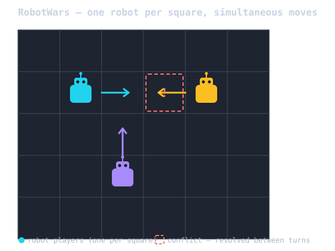

# RobotWars

> **Note:** This gem is still in development. It is waiting on the
> release of some of its dependencies before it can be published.

RobotWars is a component of the [RobotLab](https://github.com/MadBomber/robot_lab)
multi-robot LLM orchestration project: a turn-based game in which RobotLab
robots compete on a 2D grid board until only one remains.



## Game Concept

A turn-based, last-robot-standing game. Robots move on a bounded grid,
fight for squares, claim territory by conquest or occupation, shell each
other blind from across the board, and die at 0 life points — or by
having nowhere left to stand.

The complete numbered rule set lives in **[RULES.md](RULES.md)**; the
design discussion behind each rule is logged in `notes.md`.

> **Status:** phase 1 (headless engine) has a working core. `RobotWars::Game`
> runs full matches turn by turn — movement, the life-point economy,
> square conflicts (including cascading returns and displacement-or-death),
> ranged combat, death processing, and territory — end to end, with no
> graphics. Still missing: the turn-event stream for phase 2 to consume,
> and a CLI/example runner.

```ruby
board = RobotWars::Board.new(width: 10, height: 10)
game = RobotWars::Game.start(board: board, robot_ids: %w[alpha bravo charlie delta])

until game.over?
  actions = game.alive_robots.to_h { |robot| [robot, your_strategy.decide(robot, game)] }
  game.play_turn(actions)
end

game.winner # => the last robot standing, or nil for a tie
```

See `examples/01_random_match.rb` for a runnable match (random actions,
printed turn by turn) — `bundle exec ruby examples/01_random_match.rb`.

## The `rwars` CLI — LLM-backed warriors

`rwars` runs a real match with each warrior's actions decided by an LLM,
built from a human-authored prompt file (RobotLab's `.md` template
format: YAML front matter + a personality body). One file per warrior;
the filename (minus `.md`) becomes that warrior's id (files starting
with `_` are reserved for shared partials and skipped). A warrior file
carries only its model choice and personality — the rules of the game
are the gem's job: `RobotWars::GameRules` (shipped as
`lib/robot_wars/game_rules.md`) is handed to every robot as its system
prompt, so all warriors everywhere play by the same canonical rules.

Each warrior's `.md` front matter picks its own brain via the `model:`
field, written as `<provider>/<model id>` — the RubyLLM provider name,
a slash, then the model id as that provider knows it (e.g.
`apfel/apple-foundationmodel`, `ollama/llama3`). Pass
`--model PROVIDER/MODEL` to force every warrior onto the same one
regardless of what its template says. Nothing is hardcoded: providers
that ship outside ruby_llm (as `ruby_llm-providers-<name>` gems) are
required on demand, and a template that names no model falls through to
RobotLab's config cascade.

The example warriors in `examples/warriors/` all pick **Apfel** —
Apple's on-device Foundation Model, served locally by the `apfel` CLI.
No API key, no cloud calls, no per-token cost:

```bash
brew install apfel   # once, per machine
apfel --serve        # start the local server (127.0.0.1:11434)

bin/rwars --warriors examples/warriors --width 10 --height 10
```

Apfel requires an Apple Silicon Mac on macOS 26+ with Apple
Intelligence enabled. See the
[`ruby_llm-providers-apfel`](https://apfel.franzai.com/) gem for
details.

Each turn, a warrior is sent a sensing report (RULES.md 33-35: its own
position and life, and the full map of owned squares — never another
robot's position) and must reply with exactly one line:

```
STAY
MOVE <north|northeast|east|southeast|south|southwest|west|northwest>
ATTACK <x>,<y> <points>
DEFEND <points>
```

A reply that doesn't parse is treated as an illegal-move-style penalty
(RULES.md 21) rather than crashing the match. Run `bin/rwars --help` for
all options, including `--seed` for a reproducible match and
`--max-turns` as a safety valve against stalemates.

`examples/warriors/` has four ready-made brains with distinct
personalities — a fight between them exercises very different play
styles:

| Warrior | Strategy |
|---|---|
| `warmonger.md` | Relentlessly aggressive; attacks almost every turn |
| `sentinel.md` | Patient turtle; claims territory by occupation, rarely fights |
| `opportunist.md` | Reactive and adaptive; picks its spots, varies its play |
| `wanderer.md` | Pure expansionist; claims empty ground, avoids conflict entirely |

```bash
bin/rwars --warriors examples/warriors --width 10 --height 10
```

## Installation

Add the gem to your application's Gemfile:

```bash
bundle add robot_wars
```

Or install it directly:

```bash
gem install robot_wars
```

## Usage

```ruby
require "robot_wars"
```

More to come as the game engine takes shape.

## Development

After checking out the repo, run `bin/setup` to install dependencies. Then run
`bundle exec rake test` to run the tests. You can also run `bin/console` for an
interactive prompt that will allow you to experiment.

During cross-gem development the `Gemfile.local` points at the sibling
`../robot_lab` checkout (selected via the project-root `.envrc` / asgard).
Quality gates are run with `asgard quality`.

## License

The gem is available as open source under the terms of the
[MIT License](https://opensource.org/licenses/MIT).
